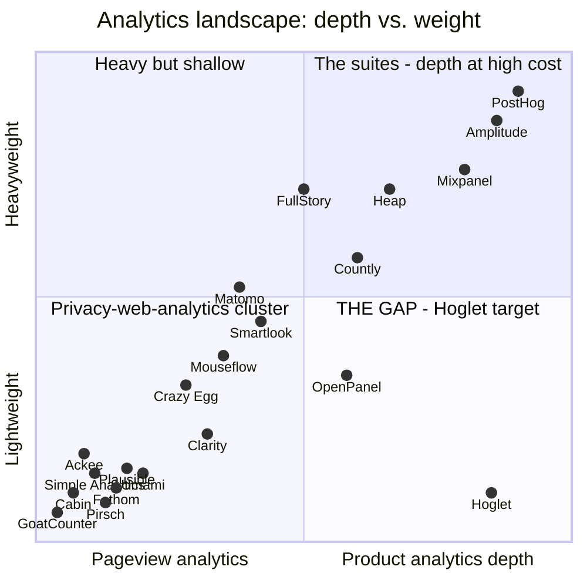

# The Analytics Industry Map

A taxonomy of every tool in the "analytics alternative" search space, what each actually does, and where Hoglet sits. Companion doc to [why-hoglet.md](why-hoglet.md).

**Key insight up front:** these tools are *not* all PostHog alternatives. They span five distinct product categories that only look similar because they all involve a JS snippet and a dashboard. Understanding which category each belongs to — and which categories Hoglet does and doesn't compete in — is the map.

---

## The five categories

### 1. Privacy-first web analytics (pageview-level)
*"How much traffic does my site get, from where?"* — cookieless, no consent banner, tiny script, aggregate-only. The GA-exodus destination.

| Tool | What it is | OSS | Notes |
|---|---|---|---|
| **Plausible** | The category leader. Elixir/ClickHouse, EU, ~$9/mo or self-host | AGPL | <1 KB script; the benchmark everyone compares against |
| **Fathom** | SaaS-only, Canada. Polished, simple | No (was once) | Positions on "GDPR without banners" |
| **Umami** | Self-host favorite. Node/Postgres | MIT | ~2 KB script, trivial deploy |
| **Simple Analytics** | Dutch SaaS, strict no-PII stance | No | No user paths/cohorts by design |
| **Pirsch** | Go, single-binary-ish, cookieless | AGPL (core) | Closest architecturally to hoglet's ethos — but pageview-scope |
| **GoatCounter** | One-person project (Go), donation-funded | EUPL | The minimalist extreme |
| **Ackee** | Node/GraphQL self-hosted | MIT | Semi-dormant; niche |
| **Cabin** | Carbon-aware, privacy-first | No | Micro-niche (sustainability angle) |
| **Matomo** | The OG GA replacement (ex-Piwik), PHP/MySQL | GPL | Actually category 1 *trying* to be 2+3: has events, funnels (paid), heatmaps, replay — but 2010-era PHP architecture, ~23 KB script, heavy ops |

**Ceiling of this category:** pageviews, referrers, goals, maybe simple funnels. No user-level analysis, no retention cohorts, no flags. This is the "simplicity without depth" side of the gap documented in why-hoglet.md §3.

### 2. Product analytics (user/event-level)
*"What do users do inside my product, do they come back, where do they drop off?"* — identified users, event streams, funnels, retention, cohorts. **This is Hoglet's category.**

| Tool | What it is | OSS | Notes |
|---|---|---|---|
| **PostHog** | The all-in-one suite (analytics + replay + flags + experiments + surveys + CDP + warehouse) | MIT (core) | The incumbent hoglet targets; see why-hoglet.md |
| **Mixpanel** | Event-analytics pioneer, SaaS-only | No | Pricing opacity, taxonomy rot, 2025 breach (see why-hoglet.md §2) |
| **Amplitude** | Enterprise product analytics, now a roll-up (absorbed June.so, Statsig) | No | ~$64K median contract; the "success tax" archetype |
| **Heap** | Autocapture-everything analytics (acquired by Contentsquare) | No | Autocapture noise + steep pricing; effectively enterprise-only now |
| **Countly** | Mobile-first product analytics, self-hostable | AGPL (core) | Long tail; enterprise edition holds the good features |
| **OpenPanel** | OSS PostHog-lite (ClickHouse/Postgres/Redis, Docker) | AGPL | The closest existing competitor to hoglet's positioning — but still a multi-service deploy, and no wire compatibility with PostHog |

### 3. Session replay, heatmaps & behavior visualization
*"Show me what the user saw and clicked."* — qualitative, per-session, video-like. Adjacent to product analytics; often bundled into it.

| Tool | What it is | OSS | Notes |
|---|---|---|---|
| **FullStory** | Enterprise DXP replay (~$28K/yr median) | No | Opaque pricing archetype (why-hoglet.md §2.1) |
| **Microsoft Clarity** | **Free, unlimited** replay + heatmaps | No | The category killer — free forever, subsidized by Microsoft; data is the price |
| **Hotjar** | SMB heatmaps/replay/surveys (Contentsquare-owned) | No | 150–250 KB script; post-acquisition pricing creep |
| **Smartlook** | Web+mobile replay (Cisco-owned) | No | Mobile-app replay strength |
| **Mouseflow** | Mid-market replay/heatmaps/friction scores | No | |
| **Crazy Egg** | The original heatmap tool (2006) | No | Legacy; scroll/click maps |

### 4. Mobile attribution (MMP)
*"Which ad network drove this app install?"* — **AppsFlyer** (plus Adjust, Branch). Ad-spend attribution, SKAdNetwork, fraud detection. A completely different industry that shares nothing with product analytics except the word "analytics." Not hoglet's business.

### 5. Marketing data pipelines / reporting ETL
*"Aggregate my ad-spend data from 500 sources into a warehouse/dashboard."* — **Funnel.io** (despite the name, it has nothing to do with funnel analysis; it's marketing-data ETL for agencies/CMOs). Also not hoglet's business.

---

## The landscape graph

Two axes explain the whole industry: **analytical depth** (pageviews → full user-level product analytics) and **operational weight** (script size, services to run, contract complexity). Every tool clusters into three corners — and one corner is nearly empty.

(AppsFlyer and Funnel.io are omitted — different industries entirely.)

**Reading the graph:**

- **Bottom-left cluster** (Plausible, Umami, Fathom, Pirsch, GoatCounter…): crowded. A dozen tools compete on being the lightest pageview counter. Differentiation here is nearly exhausted.
- **Top-right cluster** (PostHog, Amplitude, Mixpanel, Heap): the suites. Depth exists only bundled with operational and financial weight — the six failure modes documented in why-hoglet.md §2.
- **Middle** (Matomo, Countly, OpenPanel): tools drifting toward the gap but carrying legacy architecture (Matomo: PHP/MySQL, 2010), enterprise-gated features (Countly), or multi-service deploys without ecosystem compatibility (OpenPanel).
- **Bottom-right**: nearly empty. Product-analytics depth at pageview-counter weight. That's Hoglet — and the wire-compat move means it enters that corner with PostHog's entire SDK ecosystem already attached, which no other tool in or near the gap has.

## Who is actually a "PostHog alternative"?

Strictly: only category 2 (Mixpanel, Amplitude, Heap, Countly, OpenPanel — and hoglet). Categories 1 and 3 replace *slices* of PostHog (web analytics, replay) but can't replace the product-analytics core. Categories 4 and 5 are unrelated industries caught in the same SEO net.

That SEO net is itself a finding: this list mirrors a programmatic comparison-page strategy (one "Best X Alternative" landing page per tool in the space) — the acquisition playbook OpenPanel is running. People shop this market by searching "«tool I'm leaving» alternative," which means every tool on this map — even the unrelated ones — is a doorway keyword for whoever writes the comparison content. Cheap, compounding, and worth copying when hoglet is ready for an audience.

## Strategic implications for Hoglet

1. **Compete in category 2, borrow positioning from category 1.** The privacy-web-analytics cluster proved the demand for lightweight + cookieless + self-hosted; hoglet delivers that *plus* the depth they structurally lack.
2. **Category 3 is a feature, not a fight.** Replay is where suites bloat (biggest payloads, biggest storage, Clarity gives it away free). Punt via the `/decide` recording-disabled escape hatch; add later only if users demand it.
3. **Matomo and OpenPanel are the cautionary tales in the gap's neighborhood** — Matomo shows what happens when a shallow tool bolts on depth over a legacy architecture; OpenPanel shows the gap is visible to others but is being attacked without the single-binary radicalism or the ecosystem-inheritance move.
4. **Clarity is the reminder that free-as-strategy exists.** Microsoft gives replay away to feed Bing/ads data. Hoglet's answer to "free" is *sovereign*: free and it's your hardware, your data, no subsidy with strings.
